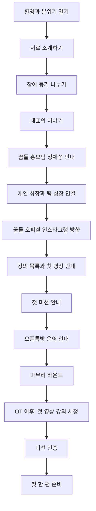

# 홍보팀 OT 준비

태스크 기간: 2026년 5월 8일 → 2026년 5월 19일
진행상황: 예정
시작 D-day(DP2): 🌱 시작 : 2026.05.08(금)ﾠﾠﾠﾠ🔴 시작 지연(3일)
마감 D-day(DP2): 🌳 마감 : 2026.05.19(화)ﾠﾠﾠﾠ🕖 마감 D-day : 8일
[F] 지난달: No
10% 보완 계획: 핵심 구조는 제작실과 미션룸 분리까지 포함한다. 남은 10%는 디자인 정리, 안내 문구 다듬기, 영상 링크/썸네일 정리, 미션 난이도 조정, 리허설로 제한한다.
90% 달성률: 0
90% 목표일: 2026년 5월 10일 오전 12:00
90% 완료: No
90% 정의: OT 진행안, 구글 슬라이드, 운영자용 영상 강의 제작실, 참가자용 미션룸, 1강 영상과 1강 미션 답변 공간이 분리되어 준비된 상태
다음 리마인드: 2026년 5월 8일 오전 9:00 (GMT+9)
로켓 단계: 1일차 구조 잡기
로켓 브리핑 완료: No
로켓 시작일: 2026년 5월 8일 오전 12:00 (GMT+9) → 2026년 5월 19일 오후 11:59 (GMT+9)
리마인더 등록: No
막힘 이유: 확인 필요
복구 필요: No
성공 기준: 참가자들이 OT에서 관계와 참여 동기를 나누고, 참가자 미션룸에서 1강을 본 뒤 미션을 작성하고 서로의 답변을 주고받기 시작하는 상태
예상 뽀모도로: 52
최종 마감일: 2026년 5월 20일
핵심 산출물: 구글 슬라이드 + OT 진행 시나리오 + 영상 강의 제작실 + 참가자 미션룸 + 1강 영상/미션 + 강의 목차 세부 설계

## 🧭 로켓 브리핑 정리

<aside>
🚀

홍보팀 OT의 핵심은 “꿈들 홍보를 잘하기 위한 업무 설명회”가 아니라, **참가자들이 자기 이야기를 콘텐츠로 만들며 성장하고, 그 성장이 꿈들의 선한 영향력 확산으로 이어지는 출발점**을 만드는 것

</aside>

## 🎯 OT 핵심 목적

### 참가자가 OT 후 느껴야 하는 상태

- “참여하길 잘했다”
- “나도 성장하고 싶다”
- “내 이야기도 콘텐츠가 될 수 있겠다”
- “꿈들 홍보팀은 단순히 홍보물을 만드는 곳이 아니라, 나와 팀이 함께 성장하는 곳이구나”
- “처음부터 주제가 완벽하지 않아도, 한 편씩 만들면서 내 주제를 찾아갈 수 있겠구나”

### 홍보팀을 운영하는 이유

- 꿈들이라는 비영리 민간 단체의 장기적인 홍보 기반을 만들기 위함
- 꿈들 오피셜 인스타그램을 중심으로 단체의 이야기, 아이들의 이야기, 선생님들의 이야기를 꾸준히 발신하기 위함
- 참가자들이 꿈들 오피셜 계정 운영을 통해 SNS 운영 노하우를 배우고, 각자 키우고 싶은 개인 계정에도 적용하게 하기 위함
- 개인의 콘텐츠 성장과 꿈들 홍보가 서로 연결되는 선순환 구조를 만들기 위함
- 최소 2년 동안 지속 가능한 홍보팀 운영 기반을 만들기 위함

## 🧩 홍보팀 정체성

### 한 문장 정의

> 꿈들 홍보팀은 꿈들의 이야기를 세상에 전하면서, 동시에 각자의 이야기를 발견하고 콘텐츠로 성장시키는 스토리메이커 팀
> 

### 스토리메이커와의 연결

스토리메이커의 정체성은 다음과 같다.

> 많은 사람이 자신의 이야기와 과정을 통해 전문성을 갖추고, 그 전문성을 다른 사람들에게 나눔으로써 서로를 위해 기여하고 행복하게 사는 공동체
> 

꿈들 홍보팀은 이 정체성을 꿈들 안에서 실험하고 실천하는 팀이다.

- 꿈들 오피셜 SNS는 단체의 이야기를 전하는 채널
- 참가자 개인 SNS는 각자의 삶과 배움을 콘텐츠로 꺼내는 채널
- 두 채널은 경쟁 관계가 아니라 서로를 키우는 관계
- 개인이 성장하면 그 영향력이 주변으로 퍼지고, 그 과정에서 꿈들에 대한 관심도 함께 커짐
- 꿈들이 커지면 참가자에게 더 많은 이야기와 배움의 장이 생김

### 핵심 모토

> 모든 사람은 스토리 메이커다
> 

### 서브 메시지

> 내가 걸어온 길이 누군가의 지도가 됩니다
> 

### 꿈들 홍보팀 버전 메시지

> 우리의 이야기는 누군가에게는 꿈이 됩니다
> 

## 👥 참가자 이해

### 현재 참가자 상태

- 참가자 수: 5명
- 모두 정기적으로 콘텐츠를 발행해 본 경험은 없음
- 일부는 자신만의 콘텐츠 주제를 정함
- 일부는 아직 주제를 정하지 못함
- 대부분 대표를 신뢰해서 참여
- 대표의 SNS 운영 사례를 보고 “이 사람에게 배워도 되겠다”고 느낀 사람도 있음
- 가볍게 참여한 사람과 개인 콘텐츠 성장을 기대하는 사람이 섞여 있음

### 참가자가 가진 가능성

- 아직 정기 발행 경험은 없지만, 신뢰 기반으로 모였기 때문에 관계 형성 가능성이 높음
- 콘텐츠 주제가 없는 사람도 “한 편씩 만들며 찾는 방식”으로 시작 가능
- 대표의 실제 사례를 통해 “처음부터 주제가 확정되지 않아도 된다”는 안도감을 줄 수 있음
- 각자의 개인 계정 성장이 팀 전체의 홍보 자산이 될 수 있음

### OT에서 반드시 해소해야 할 불안

- “나는 콘텐츠 주제가 없는데 괜찮을까?”
- “정기적으로 올려본 적이 없는데 할 수 있을까?”
- “꿈들 홍보를 해야 한다면 부담스럽지 않을까?”
- “내 개인 계정 성장과 꿈들 홍보가 어떻게 연결될까?”
- “내가 이 팀에서 어떤 역할을 하면 될까?”

## 📣 꿈들 오피셜 SNS 방향

### 우선 운영 채널

- 인스타그램

### 꿈들 오피셜 계정의 기본 이미지

- 아이들을 위하는 단체
- 선생님들을 위하는 단체
- 저소득층 아동을 위한 봉사를 하는 단체
- 제주도 초등 교사를 위해 연수를 운영하는 단체
- 따뜻하고 진정성 있는 이야기 중심의 계정
- 보여주기식 홍보보다 실제 사람과 성장의 이야기를 담는 계정

### 가장 먼저 발행해야 할 콘텐츠 주제

- 아이들에 대한 이야기
- 선생님들에 대한 이야기
- 꿈들이 왜 존재하는지 보여주는 이야기
- 꿈들 활동에 참여한 사람들의 변화
- 꿈들 안에서 발견되는 작은 장면과 진심
- 봉사와 연수가 남긴 기록
- “아이들과 선생님을 위해 우리가 왜 움직이는가”를 보여주는 콘텐츠

### 콘텐츠 방향

| 방향 | 설명 |
| --- | --- |
| 스토리형 | 사람, 장면, 변화, 마음을 중심으로 전개 |
| 참여자 성장 기록형 | 홍보팀 참가자들이 콘텐츠 생산자로 성장하는 과정 기록 |
| 단체 활동 기록형 | 꿈들의 봉사, 연수, 행사, 준비 과정을 꾸준히 기록 |
| 정보 전달형 | 필요할 때만 보조적으로 사용 |

## 📚 스토리메이커 철학 반영

### 중심 행위

> 이번 주에 한 편을 만들어 세상에 내놓는다
> 

홍보팀 활동의 중심은 완벽한 브랜딩 전략이 아니라 “한 편의 콘텐츠 만들기”이다.  

한 편을 만들면서 발견, 다듬기, 확산이 동시에 일어난다.

### 동심원 모델

| 층 | 의미 | 홍보팀 적용 |
| --- | --- | --- |
| 중심 | 한 편의 콘텐츠 만들기 | 꿈들 이야기 또는 개인 이야기를 한 편 만들어 발행 |
| 1차 동심원 | 꾸준함의 기술 | 매주 한 편씩 지속하는 방법 배우기 |
| 2차 동심원 | 응원받는 환경 | 오픈톡방, 미션 인증, 서로 피드백, 팀 응원 |
| 3차 동심원 | 더 멀리 | 개인 계정 성장, 꿈들 홍보 확산, 외부 영향력 확대 |

### 3대 철학

1. 가르치지 말고, 깨닫게 하라
    - 정보 전달보다 “어? 나도 저랬는데?”라는 자기 인식의 순간을 만든다.
2. 많이가 아니라 꾸준히
    - 30일에 30개 만들고 멈추는 것보다, 매주 한 편씩 오래 가는 사람이 더 강력하다.
3. 자기에게 맞는 매체를 탐색
    - 인스타그램이 우선 채널이지만, 개인에게는 각자 맞는 매체를 찾아가게 한다.
    - 조회수 얻기와 자신만의 색깔 연결

### 절대 원칙

- 1인 시점 사례를 사용한다.
- 추상적인 말보다 실제 사람의 이야기를 사용한다.
- 자기 식별 후크를 사용한다.
    - 예: “혹시 여러분도 말은 많이 하지만 정작 내 이야기는 해본 적 없다고 느낀 적 있나요?”
- 대표의 취약성 고백을 먼저 꺼낸다.
    - 예: “나도 처음부터 주제가 확정되어 있던 것은 아니다.”
- 사례 중심으로 설명한다.
- 자극적 마케팅 용어를 쓰지 않는다.
- “바이럴 비법”, “마케팅 공식”이 아니라 “내 이야기를 꾸준히 꺼내는 법”으로 말한다.

## 🧾 OT 최종 산출물 정의

### 핵심 산출물

- 구글 슬라이드
- OT 진행 시나리오
- 첫 영상 강의 안내
- 첫 미션 안내
- 오픈톡방 운영 안내
- 미션 인증/체크 방식 초안
- 홍보팀 운영 방향 안내문

### 90% 완료 정의

> 구글 슬라이드와 진행 시나리오가 준비되어, 참가자들이 홍보팀의 의미와 운영 방향을 이해하고 OT 직후 첫 영상 강의를 보며 첫 미션을 시작할 수 있는 상태
> 

### 성공 기준

- 참가자들이 “참여하길 잘했다”고 느낌
- 참가자들이 “나도 성장하고 싶다”고 느낌
- 꿈들 홍보팀의 정체성이 전달됨
- 스토리메이커 철학과 꿈들 홍보팀의 연결이 이해됨
- 꿈들 오피셜 인스타그램 운영 방향이 설명됨
- 개인 SNS 성장과 꿈들 홍보의 선순환 구조가 설명됨
- 콘텐츠 주제가 없는 사람도 시작할 수 있다는 안도감을 얻음
- OT 직후 볼 영상 강의와 첫 미션이 명확함
- 오픈톡방에서 무엇을 인증해야 하는지 알 수 있음

## 🗣️ OT 핵심 메시지 초안

### 시작 메시지

여러분이 오늘 홍보팀에 들어온 이유가 모두 같지는 않을 수 있습니다.  

누군가는 저를 믿고 왔고, 누군가는 SNS를 배워보고 싶어서 왔고, 누군가는 꿈들을 돕고 싶어서 왔을 수 있습니다.

그런데 저는 이 팀이 단순히 꿈들 홍보물을 만드는 팀이 아니었으면 합니다.  

꿈들 홍보팀은 꿈들의 이야기를 세상에 전하면서, 동시에 여러분 각자의 이야기도 발견하고 콘텐츠로 만들어가는 팀입니다.

### 개인 성장 메시지

처음부터 자기 주제가 분명하지 않아도 괜찮습니다.  

저도 처음부터 제 주제가 완성되어 있던 것이 아닙니다.  

한 편씩 만들면서 내가 무엇을 계속 말하고 싶은 사람인지 알게 됩니다.

### 팀 성장 메시지

여러분이 자기 이야기를 콘텐츠로 만들고, 자기 계정을 키워가면 그 영향력은 결국 주변 사람들에게 닿습니다.  

그 사람들이 여러분을 통해 꿈들을 알게 되고, 꿈들의 이야기에 관심을 갖게 됩니다.  

그러면 개인의 성장이 팀의 성장으로 이어지고, 팀의 성장이 다시 개인에게 더 좋은 이야기와 배움의 장을 만들어줍니다.

### 마무리 메시지

이 팀의 목표는 단순히 계정을 키우는 것이 아닙니다.  

우리의 이야기가 누군가에게는 꿈을 이어가는 지도가 되게 하는 것입니다.

## 🧑‍🏫 구글 슬라이드 구성안

| 슬라이드 | 제목 | 핵심 내용 |
| --- | --- | --- |
| 1 | 꿈들 홍보팀 OT | 오늘의 목적: 참여하길 잘했다, 나도 성장하고 싶다 |
| 2 | 왜 홍보팀을 시작하나 | 꿈들 홍보 기반, 2년 운영, 오피셜 SNS 운영 |
| 3 | 꿈들 홍보팀은 무엇인가 | 단순 홍보팀이 아니라 스토리메이커 팀 |
| 4 | 스토리메이커란 무엇인가 | 모든 사람은 스토리 메이커다 / 걸어온 길이 누군가의 지도가 됩니다 |
| 5 | 나도 처음부터 주제가 있던 것은 아니다 | 대표의 실제 사례와 취약성 고백 |
| 6 | 한 편의 콘텐츠 만들기 | 발견, 다듬기, 확산이 동시에 일어나는 중심 행위 |
| 7 | 꾸준함의 기술 | 많이가 아니라 꾸준히 / 매주 한 편 |
| 8 | 응원받는 환경 | 오픈톡방, 미션 인증, 서로 응원하는 구조 |
| 9 | 더 멀리 | 개인 계정 성장과 꿈들 홍보의 선순환 |
| 10 | 꿈들 오피셜 인스타그램 방향 | 아이들, 선생님들, 봉사, 연수, 변화의 이야기 |
| 11 | 참가자 개인 계정은 어떻게 연결되나 | 각자의 성장 기록이 팀의 자산이 되는 구조 |
| 12 | 앞으로의 강의 흐름 | 영상 강의 전체 개요와 강의 목록 소개 |
| 13 | 첫 미션 | 영상 강의 보기 + 자기소개/콘텐츠 씨앗 찾기/첫 한 편 준비 |
| 14 | 오픈톡방 운영 방식 | 미션 인증, 체크, 질문, 응원 방식 |
| 15 | 오늘의 마무리 | 참여하길 잘했다 / 나도 성장하고 싶다 / 한 편부터 시작 |

## 🎬 영상 강의 목록 초안

<aside>
🎥

영상 강의는 “SNS를 잘하는 법”을 알려주는 강의라기보다, 참가자들이 **내 이야기를 한 편의 콘텐츠로 만들고, 꾸준히 발신하는 사람**으로 성장하도록 돕는 흐름

</aside>

### 강의 전체 흐름

| 순서 | 강의 제목 | 핵심 질문 | 참가자 산출물 |
| --- | --- | --- | --- |
| 1강 | 모든 사람은 스토리 메이커다 | 왜 내 이야기가 콘텐츠가 될 수 있을까? | 내가 콘텐츠를 만들고 싶은 이유 한 문장 |
| 2강 | 처음부터 주제가 없어도 괜찮다 | 나는 무엇을 말하고 싶은 사람일까? | 콘텐츠 씨앗 5개 |
| 3강 | 한 편의 콘텐츠 만들기 | 이번 주에 세상에 내놓을 한 편은 무엇인가? | 첫 콘텐츠 주제 1개 |
| 4강 | 나의 걸어온 길이 누군가의 지도가 된다 | 내 경험 중 누군가에게 도움이 될 이야기는 무엇인가? | 경험 기반 콘텐츠 초안 |
| 5강 | 꿈들의 이야기를 콘텐츠로 보는 법 | 아이들과 선생님들의 이야기에서 무엇을 발견할 수 있을까? | 꿈들 오피셜 콘텐츠 소재 3개 |
| 6강 | 인스타그램에서 한 편을 만드는 법 | 내 이야기를 카드뉴스/사진+캡션/릴스로 어떻게 바꿀까? | 인스타 게시물 초안 |
| 7강 | 많이가 아니라 꾸준히 | 내가 지치지 않고 계속할 수 있는 발행 리듬은 무엇인가? | 개인 발행 루틴 |
| 8강 | 응원받는 환경 만들기 | 혼자 하지 않으려면 무엇을 공유해야 할까? | 오픈톡방 인증 루틴 |
| 9강 | 개인 계정 성장과 꿈들 홍보의 연결 | 내 성장이 어떻게 꿈들의 선한 영향력으로 이어질까? | 개인 성장 공유 문장 |
| 10강 | 한 편을 100편으로 만드는 법 | 하나의 이야기를 어떻게 계속 확장할까? | 콘텐츠 시리즈 아이디어 |

### OT에서 보여줄 강의 목록 요약

OT에서는 전체 강의를 길게 설명하지 않고 아래처럼 안내합니다.

1. 먼저 “내 이야기가 왜 콘텐츠가 되는지”를 배움
2. 아직 주제가 없는 사람도 콘텐츠 씨앗을 찾음
3. 이번 주에 한 편을 만들어보는 실습을 함
4. 꿈들 오피셜 인스타그램에 올릴 이야기를 함께 찾음
5. 개인 계정과 꿈들 계정이 함께 성장하는 구조를 만듦
6. 오픈톡방에서 서로 인증하고 응원하며 지속함

## 🎥 첫 영상 강의 상세 설계

### 첫 영상 강의 제목

> 모든 사람은 스토리 메이커다: 내 이야기가 콘텐츠가 되는 순간
> 

### 첫 영상 강의 목적

- 참가자들이 “나도 콘텐츠를 만들 수 있겠다”고 느끼게 하기
- 처음부터 완벽한 주제가 없어도 괜찮다는 안도감 주기
- 꿈들 홍보팀이 단순 업무팀이 아니라 성장 공동체라는 인식 만들기
- 첫 미션을 부담 없이 시작하게 하기

### 첫 영상 강의 핵심 메시지

- 모든 사람은 이미 자기만의 이야기를 가지고 있음
- 콘텐츠는 특별한 사람만 만드는 것이 아님
- 내가 걸어온 길이 누군가에게는 지도가 될 수 있음
- 처음부터 주제가 완성되어 있지 않아도 괜찮음
- 한 편씩 만들면서 내가 계속 말하고 싶은 주제를 발견하게 됨
- 꿈들 홍보팀은 꿈들의 이야기와 나의 이야기를 함께 발견하는 팀

### 첫 영상 강의 구성안

| 파트 | 내용 | 예상 시간 |
| --- | --- | --- |
| 오프닝 | 왜 이 강의를 보는지 안내 | 1분 |
| 대표 사례 | 나도 처음부터 콘텐츠 주제가 확정되어 있지 않았다는 이야기 | 3분 |
| 스토리메이커 철학 | 모든 사람은 스토리 메이커다 / 걸어온 길이 누군가의 지도가 됩니다 | 3분 |
| 한 편의 콘텐츠 | 발견, 다듬기, 확산은 한 편을 만들며 동시에 일어남 | 3분 |
| 꿈들 홍보팀 연결 | 개인 이야기와 꿈들 이야기가 함께 성장하는 구조 | 2분 |
| 첫 미션 안내 | 오늘 바로 해야 할 작은 행동 안내 | 2분 |

## ✅ 첫 영상 강의 후 미션

<aside>
✅

첫 미션은 “잘 쓰기”가 아니라 **나도 시작할 수 있다는 감각을 만드는 것**이 목적

</aside>

### 미션 1. 영상 강의 보기

- [ ]  첫 영상 강의를 끝까지 보기
- [ ]  가장 기억에 남는 문장 1개 적기
- [ ]  오픈톡방에 인증하기

인증 예시:

> 미션1 완료 / 이름 / 가장 기억에 남은 문장: “걸어온 길이 누군가의 지도가 됩니다”
> 

### 미션 2. 내가 콘텐츠를 만들고 싶은 이유 한 문장 쓰기

질문:

- 나는 왜 콘텐츠를 만들어보고 싶은가?
- 내가 누군가에게 나누고 싶은 경험은 무엇인가?
- 내가 성장하고 싶은 이유는 무엇인가?

작성 예시:

> 나는 내가 겪은 시행착오가 누군가에게 작은 용기가 될 수 있다고 생각해서 콘텐츠를 만들어보고 싶다.
> 

인증 예시:

> 미션2 완료 / 이름 / 내가 콘텐츠를 만들고 싶은 이유: “…”
> 

### 미션 3. 나의 콘텐츠 씨앗 5개 적기

콘텐츠 씨앗은 완성된 주제가 아니라, 앞으로 이야기로 키워볼 수 있는 작은 소재입니다.

예시 카테고리:

- 내가 오래 고민해온 것
- 내가 배워온 것
- 내가 실패해본 것
- 내가 누군가에게 자주 설명하는 것
- 내가 좋아해서 계속 찾아보는 것
- 내 주변 사람이 나에게 자주 물어보는 것
- 꿈들 활동을 하며 인상 깊었던 장면

작성 양식:

1. 
2. 
3. 
4. 
5. 

인증 예시:

> 미션3 완료 / 이름 / 콘텐츠 씨앗 5개: 1) … 2) … 3) … 4) … 5) …
> 

### 미션 4. 꿈들 오피셜 계정에 올릴 수 있는 이야기 소재 1개 찾기

질문:

- 아이들에 대해 전할 수 있는 따뜻한 장면은 무엇인가?
- 선생님들에게 도움이 될 수 있는 이야기는 무엇인가?
- 꿈들이 왜 필요한지 보여줄 수 있는 사례는 무엇인가?
- 봉사나 연수 현장에서 사람들이 공감할 만한 순간은 무엇인가?

작성 예시:

> 제주 선생님들이 연수 이후 교실에서 아이들을 바라보는 시선이 어떻게 달라졌는지 이야기로 풀어보고 싶다.
> 

인증 예시:

> 미션4 완료 / 이름 / 꿈들 오피셜 콘텐츠 소재: “…”
> 

### 미션 5. 이번 주 나의 한 편 정하기

질문:

- 이번 주에 내가 세상에 내놓을 수 있는 가장 작은 한 편은 무엇인가?
- 글, 카드뉴스, 사진+캡션, 짧은 영상 중 무엇이 가장 부담이 적은가?
- 완성도가 낮아도 올릴 수 있는 형태는 무엇인가?

작성 양식:

- 이번 주 나의 한 편:
- 사용할 매체:
- 예상 발행일:
- 도움이 필요한 부분:

인증 예시:

> 미션5 완료 / 이름 / 이번 주 나의 한 편: “처음 콘텐츠를 시작하는 마음” / 매체: 인스타 사진+캡션 / 발행일: 일요일
> 

## 🧭 퍼실리테이션형 OT 흐름

<aside>
🧭

OT는 대표가 일방적으로 설명하는 시간이 아니라, 참가자들이 서로를 알고, 참여 이유를 말하고, “이 팀에서 나도 성장할 수 있겠다”는 감각을 얻는 퍼실리테이션 흐름으로 진행

</aside>

### 전체 진행 구조

| 순서 | 파트 | 목적 | 방식 | 예상 시간 |
| --- | --- | --- | --- | --- |
| 1 | 환영과 분위기 열기 | 참여 긴장 낮추기 | 대표 인사, 오늘의 목적 안내 | 5분 |
| 2 | 서로 소개하기 | 참가자 간 관계 형성 | 이름, 요즘 관심사, 나를 표현하는 키워드 공유 | 15분 |
| 3 | 참여 동기 나누기 | 각자의 기대와 니즈 확인 | 왜 참여했는지, 무엇을 얻고 싶은지 공유 | 15분 |
| 4 | 대표의 이야기 | 신뢰와 방향성 형성 | 처음부터 주제가 없었던 사례, SNS 운영 경험 공유 | 10분 |
| 5 | 꿈들 홍보팀 정체성 안내 | 팀의 의미 이해 | 스토리메이커 철학, 꿈들 홍보팀 한 문장 정의 | 10분 |
| 6 | 개인 성장과 팀 성장 연결 | 참여 동기 강화 | 개인 계정 성장과 꿈들 홍보의 선순환 설명 | 10분 |
| 7 | 꿈들 오피셜 인스타그램 방향 | 실제 운영 방향 이해 | 아이들, 선생님, 봉사, 연수 이야기 방향 안내 | 10분 |
| 8 | 강의 목록과 첫 영상 안내 | 학습 흐름 이해 | 전체 강의 목록, 첫 영상 강의, 시청 방식 안내 | 10분 |
| 9 | 첫 미션 안내 | 바로 시작할 행동 확정 | 영상 시청 후 미션 1~5 안내 | 10분 |
| 10 | 오픈톡방 운영 안내 | 지속 구조 만들기 | 인증 방식, 질문 방식, 응원 규칙 안내 | 5분 |
| 11 | 마무리 라운드 | 감정적 마무리와 결속 | 오늘 가져가는 한 문장 공유 | 10분 |

### 총 예상 시간

- 약 100분
- 짧게 운영할 경우 70분 버전으로 축소 가능
- 길게 운영할 경우 120분까지 확장 가능

## 🗺️ OT 흐름도

## 🧩 퍼실리테이션 질문지

### 서로 소개하기 질문

- 이름은 무엇인가요?
- 요즘 가장 관심 있는 것은 무엇인가요?
- 나를 표현하는 키워드 1개는 무엇인가요?
- 요즘 내가 배우고 싶은 것은 무엇인가요?
- 내가 요즘 자주 생각하는 질문은 무엇인가요?

### 참여 동기 나누기 질문

- 왜 홍보팀에 참여하게 되었나요?
- 대표님을 믿고 참여했다면, 어떤 부분에서 신뢰가 생겼나요?
- SNS나 콘텐츠에 대해 기대하는 것은 무엇인가요?
- 꿈들 홍보팀에서 내가 얻고 싶은 것은 무엇인가요?
- 개인 계정도 성장시키고 싶은 마음이 있나요?
- 아직 막연하다면, 어떤 부분이 가장 막연한가요?

### 콘텐츠 씨앗 찾기 질문

- 내가 자주 이야기하게 되는 주제는 무엇인가요?
- 내가 겪은 시행착오 중 누군가에게 도움이 될 만한 것은 무엇인가요?
- 주변 사람들이 나에게 자주 물어보는 것은 무엇인가요?
- 내가 꿈들 활동에서 기대하는 장면은 무엇인가요?
- 아이들 또는 선생님과 관련해 꼭 전하고 싶은 이야기는 무엇인가요?

## 📦 최종 결과 산출물별 준비물

| 산출물 | 필요 내용 | 완료 기준 |
| --- | --- | --- |
| 구글 슬라이드 | OT 목적, 팀 정체성, 스토리메이커 철학, 강의 목록, 첫 미션, 운영 방식 | 슬라이드만 보고도 OT 진행 흐름을 알 수 있음 |
| OT 진행 시나리오 | 각 파트별 멘트, 질문, 전환 문장, 시간 배분 | 대표가 그대로 보며 진행할 수 있음 |
| 퍼실리테이션 질문지 | 소개 질문, 참여 동기 질문, 콘텐츠 씨앗 질문 | 참가자들이 말할 수 있는 질문이 준비됨 |
| 영상 강의 목록 | 10강 흐름, 각 강의 목적, 산출물 | 참가자들이 앞으로 무엇을 배우는지 이해함 |
| 첫 영상 강의 안내 | 강의 제목, 목적, 핵심 메시지, 구성 | OT 직후 바로 볼 수 있음 |
| 첫 미션 안내문 | 미션 1~5, 작성 양식, 인증 예시 | 참가자가 오픈톡방에 바로 인증 가능 |
| 오픈톡방 공지 | 인증 규칙, 질문 규칙, 응원 규칙, 미션 체크 방식 | 팀 운영의 기본 규칙이 명확함 |
| 미션 체크표 | 참가자명, 미션 번호, 인증일, 완료 여부 | 봇이 없어도 수동 운영 가능 |

## 🎓 영상 강의 페이지 구조 재설계

<aside>
🎬

영상 강의 관련 페이지는 **운영자용 제작 공간**과 **참가자용 미션 수행 공간**을 반드시 분리

</aside>

### 분리된 페이지

| 페이지 | 대상 | 목적 | 링크 |
| --- | --- | --- | --- |
| 영상 강의 제작실 | 운영자/대표님 | 목차 세분화, 스크립트, 사례, 미션, 추천 자료, 촬영 준비 | [꿈들 홍보팀 영상 강의 제작실](%EA%BF%88%EB%93%A4%20%ED%99%8D%EB%B3%B4%ED%8C%80%20%EC%98%81%EC%83%81%20%EA%B0%95%EC%9D%98%20%EC%A0%9C%EC%9E%91%EC%8B%A4%20b7222d490ba943deb0e5d926be838f04.md) |
| 참가자 미션룸 | 홍보팀 참가자 | 영상 시청, 미션 답변 작성, 다른 참가자 답변 읽기, 댓글/피드백 남기기 | [꿈들 홍보팀 참가자 미션룸](%EA%BF%88%EB%93%A4%20%ED%99%8D%EB%B3%B4%ED%8C%80%20%EC%B0%B8%EA%B0%80%EC%9E%90%20%EB%AF%B8%EC%85%98%EB%A3%B8%20b3c197b210be4379a77d36ad06317038.md) |

### 운영자용 제작실에 들어가는 것

- 영상 강의 목차 설계
- 강의별 목적과 핵심 메시지
- 강의별 세부 챕터
- 강의별 스크립트 초안
- 강의별 활용 사례
- 강의별 미션/과제 설계
- 읽으면 좋은 책
- 보면 좋은 영상
- 촬영 준비 체크리스트
- 업로드 전 검토 사항

### 참가자용 미션룸에 들어가는 것

- 참가자 안내문
- 오늘 볼 영상 링크
- 강의별 핵심 문장
- 강의별 미션
- 참가자 답변 공간
- 다른 참가자 답변 확인 공간
- 댓글/피드백 규칙
- 오픈톡방 인증 문구

### 참가자용 미션룸에 넣지 않는 것

- 운영자용 스크립트 초안
- 촬영 메모
- 목차 설계 고민
- 추천 자료 후보군
- 강의 제작 체크리스트
- 대표님 내부 기획 메모

### 영상 강의 목차 설계 방향

- 현재 10강 목차는 확정안이 아니라 초안
- 대표님이 더 자세히 구성할 수 있도록 제작실에 “목차 설계 보드”와 “세분화 질문” 중심으로 재정리
- 강의 수, 강의 길이, 공개 순서, 실습 비중은 아직 결정 필요
- 목차가 확정되기 전까지 참가자용 미션룸에는 1강 중심의 최소 구조만 유지

### OT 전까지 준비해야 할 최소 기준

- [ ]  영상 강의 제작실에서 전체 목차 구조 재설계
- [ ]  1강 세부 목차 확정
- [ ]  1강 스크립트 확정
- [ ]  1강 미션 확정
- [ ]  1강 영상 촬영 완료
- [ ]  1강 영상 참가자 미션룸에 업로드 또는 임베드
- [ ]  참가자 미션룸에 1강 답변 공간 준비
- [ ]  OT에서 두 페이지의 차이를 안내할 멘트 준비

### OT에서 안내할 문장

영상 강의와 미션은 두 공간으로 나누어 운영합니다.  

여러분이 들어가서 활동할 공간은 **참가자 미션룸**입니다.  

그곳에서 영상을 보고, 미션을 작성하고, 서로의 답변을 읽고 댓글을 남기면 됩니다.  

강의 제작실은 제가 강의를 준비하는 운영자용 공간이라 참가자 활동 공간과 분리해두겠습니다.

## ✅ 홍보팀 OT 전체 준비 체크리스트

### 1. 방향 정리

- [x]  OT 핵심 메시지 한 문장 확정
- [x]  꿈들 홍보팀 정체성 한 문장 확정
- [x]  스토리메이커와 꿈들 홍보팀 연결 문장 확정
- [x]  개인 성장과 팀 성장의 선순환 구조 정리
- [ ]  꿈들 오피셜 인스타그램의 첫 방향 정리
- [ ]  참가자 5명의 니즈 차이 정리
- [ ]  콘텐츠 주제가 없는 사람에게 줄 안내 메시지 정리

### 2. 구글 슬라이드 제작

- [ ]  슬라이드 목차 확정
- [ ]  슬라이드 1~3: OT 목적과 홍보팀 소개 작성
- [ ]  슬라이드 4~6: 스토리메이커 철학 작성
- [ ]  슬라이드 7~9: 동심원 모델 작성
- [ ]  슬라이드 10~11: 꿈들 오피셜 인스타그램 방향 작성
- [ ]  슬라이드 12: 강의 전체 개요 작성
- [ ]  슬라이드 13: 첫 미션 작성
- [ ]  슬라이드 14: 오픈톡방 운영 방식 작성
- [ ]  슬라이드 15: 마무리 메시지 작성
- [ ]  전체 슬라이드 톤 통일
- [ ]  발표용 메모 작성

### 3. OT 진행 시나리오

- [ ]  오프닝 멘트 작성
- [ ]  참가자 환영 메시지 작성
- [ ]  “참여하길 잘했다” 감정을 만드는 도입부 작성
- [ ]  대표의 SNS 성장/주제 발견 사례 정리
- [ ]  꿈들 홍보팀의 장기 비전 설명
- [ ]  개인 계정 성장과 꿈들 홍보 연결 설명
- [ ]  첫 영상 강의 안내 멘트 작성
- [ ]  첫 미션 안내 멘트 작성
- [ ]  오픈톡방 인증 방식 안내 멘트 작성
- [ ]  마무리 멘트 작성

### 4. 첫 영상 강의 안내

- [ ]  OT 직후 볼 영상 강의 선정
- [ ]  영상 강의 제목 정리
- [ ]  영상 강의 링크 준비
- [ ]  영상 강의를 왜 보는지 설명 작성
- [ ]  영상 시청 후 해야 할 행동 정리
- [ ]  영상 강의 후 인증 방법 정리

### 5. 첫 미션 설계

- [ ]  미션 1: 영상 강의 보기
- [ ]  미션 2: 내가 콘텐츠를 만들고 싶은 이유 한 문장 쓰기
- [ ]  미션 3: 나의 콘텐츠 씨앗 3개 적기
- [ ]  미션 4: 꿈들 오피셜 계정에 올릴 수 있는 이야기 소재 1개 찾기
- [ ]  미션 5: 오픈톡방에 인증하기
- [ ]  미션 난이도 조정
- [ ]  미션 예시 작성
- [ ]  인증 문구 작성

### 6. 오픈톡방 운영 준비

- [ ]  오픈톡방 공지 작성
- [ ]  미션 인증 규칙 작성
- [ ]  질문 규칙 작성
- [ ]  응원/피드백 규칙 작성
- [ ]  매주 콘텐츠 한 편 원칙 안내
- [ ]  자동 체크 봇 가능성 검토
- [ ]  봇이 어렵다면 임시 수동 체크 방식 설계
- [ ]  인증 양식 작성

### 7. 홍보팀 운영 구조

- [ ]  정기 모임 주기 결정
- [ ]  영상 강의 시청 방식 결정
- [ ]  미션 제출 주기 결정
- [ ]  꿈들 오피셜 인스타그램 콘텐츠 발행 주기 결정
- [ ]  참가자 개인 계정 성장 공유 방식 결정
- [ ]  조회수/팔로워 수 공유 방식 결정
- [ ]  스토리메이커 채널에 성장 사례를 소개하는 기준 정리
- [ ]  꿈들 홍보팀 모집에 활용할 성장 사례 기록 방식 정리

### 8. 검토/보완

- [ ]  슬라이드 전체 흐름 검토
- [ ]  발표 시간 확인
- [ ]  너무 어려운 마케팅 용어 제거
- [ ]  자극적 표현 제거
- [ ]  대표 사례 추가
- [ ]  참가자 눈높이에 맞게 수정
- [ ]  OT 리허설
- [ ]  최종 자료 공유 준비

## 🧱 실제 행동 단위 분해

### 1일차: 구조 잡기

- [ ]  OT가 끝난 뒤 참가자가 느껴야 할 감정 한 문장 작성
- [ ]  홍보팀 정체성 한 문장 작성
- [ ]  스토리메이커 핵심 문장 3개 추리기
- [ ]  대표의 “처음부터 주제가 없었다” 사례 메모 작성
- [ ]  참가자 5명의 예상 니즈를 3가지 유형으로 분류
- [ ]  꿈들 오피셜 인스타그램의 첫 콘텐츠 방향 3개 작성
- [ ]  개인 계정 성장과 꿈들 홍보의 선순환 구조를 5문장으로 설명
- [ ]  OT 전체 순서 15개 슬라이드 목차로 확정
- [ ]  첫 미션 3~5개 초안 작성

### 2일차: 핵심 제작

- [ ]  구글 슬라이드 파일 생성
- [ ]  슬라이드 1~3 작성
- [ ]  슬라이드 4~6 작성
- [ ]  슬라이드 7~9 작성
- [ ]  슬라이드 10~12 작성
- [ ]  슬라이드 13~15 작성
- [ ]  각 슬라이드 발표 메모 작성
- [ ]  첫 영상 강의 링크/제목 정리
- [ ]  첫 미션 안내문 작성
- [ ]  오픈톡방 공지 초안 작성
- [ ]  미션 인증 양식 작성

### 3일차: 90% 완성

- [ ]  구글 슬라이드 전체 흐름 점검
- [ ]  OT 진행 시나리오 작성
- [ ]  첫 미션 최종 확정
- [ ]  영상 강의 안내 문구 최종 확정
- [ ]  오픈톡방 공지 최종 확정
- [ ]  자동 체크 봇이 필요한 항목 목록화
- [ ]  봇이 없을 때 사용할 수동 체크표 작성
- [ ]  OT 리허설 1회
- [ ]  누락된 설명 표시
- [ ]  10% 보완 리스트 작성

### 10% 보완 기간

- [ ]  슬라이드 디자인 최소 정리
- [ ]  말이 길어지는 부분 줄이기
- [ ]  참가자 눈높이에 맞게 표현 수정
- [ ]  첫 과제 난이도 낮추기
- [ ]  운영진 또는 가까운 사람에게 흐름 피드백 받기
- [ ]  리허설 1회 추가
- [ ]  최종 링크/자료/오픈톡방 공지 확인

## 🧮 예상 뽀모도로

| 작업 묶음 | 예상 뽀모도로 |
| --- | --- |
| 방향 정리 | 3 |
| 슬라이드 목차/구조 확정 | 2 |
| 구글 슬라이드 초안 제작 | 6 |
| OT 진행 시나리오 작성 | 3 |
| 첫 영상 강의/미션 안내 작성 | 2 |
| 오픈톡방 운영/인증 방식 정리 | 2 |
| 검토/리허설/보완 | 3 |
| 합계 | 21 |

## 🤖 오픈톡방 미션 체크 봇 아이디어

### 원하는 기능

- 참가자가 오픈톡방에 미션 인증을 올림
- 봇이 인증 메시지를 감지
- 참가자별 미션 완료 여부를 자동 기록
- 누가 어떤 미션을 했는지 확인 가능
- 미션 완료율을 홍보팀 운영에 활용

### 우선 MVP 방식

봇을 바로 만들기 전, 먼저 수동/반자동 구조로 시작한다.

- 참가자 이름
- 미션 번호
- 인증 메시지
- 인증 날짜
- 완료 여부

예시 인증 문구:

> 미션1 완료 / 이름 / 영상 강의 시청 완료 / 오늘의 한 문장: “나도 한 편부터 시작해보겠다”
> 

### 자동화 후보

- 카카오 오픈채팅 봇
- Google Form + Google Sheet
- Notion Form
- Make 자동화
- Telegram 또는 Slack 기반 테스트 채널
- 향후 웹앱/iPhone 앱 연동

## ❓ 추가 질문

아래 질문에 답하면 OT 자료를 더 정확하게 완성할 수 있습니다.

### OT 운영 정보

1. OT 날짜와 시간은 언제인가요?
2. OT 총 진행 시간은 몇 분인가요?
3. OT는 온라인인가요, 오프라인인가요?
4. 참가자들이 OT 전에 미리 봐야 할 자료가 있나요?
5. OT 당일 참가자들이 구글 슬라이드를 직접 보나요, 아니면 대표님 발표만 듣나요?

### 강의/미션 정보

1. OT 직후 보게 할 첫 영상 강의 제목은 무엇인가요?
2. 영상 강의는 이미 촬영되어 있나요?
3. 강의 전체 개요와 강의 목록은 몇 편으로 구성되어 있나요?
4. 첫 주 미션은 몇 개까지가 적당하다고 보나요?
5. 참가자들이 첫 주에 실제로 발행까지 해야 하나요, 아니면 소재 찾기/초안 작성까지만 하면 되나요?

### 꿈들 오피셜 인스타그램 정보

1. 꿈들 오피셜 인스타그램 계정은 이미 있나요?
2. 현재 팔로워 수나 기존 게시물 수는 어느 정도인가요?
3. 첫 콘텐츠는 카드뉴스, 사진+캡션, 릴스 중 무엇이 좋나요?
4. 아이들/선생님들 이야기를 사용할 때 초상권이나 개인정보 이슈가 있나요?
5. 첫 달에 꿈들 오피셜 계정에서 몇 개의 콘텐츠를 발행하고 싶나요?

### 운영 구조 정보

1. 홍보팀 정기 모임은 주 1회인가요, 격주인가요?
2. 참가자 개인 계정 성과를 공유할 때 이름을 공개해도 되나요?
3. 팔로워/조회수 공유가 부담스러운 참가자를 위한 대안 지표가 필요할까요?
4. 오픈톡방 미션 인증은 매일인가요, 주 1회인가요?
5. 자동 체크 봇은 꼭 카카오톡 오픈채팅 안에서 작동해야 하나요, 아니면 외부 폼/노션으로 우회해도 괜찮나요?

## 🔒 90% 완료 체크 기준

- [ ]  구글 슬라이드 목차가 완성됨
- [ ]  구글 슬라이드 초안이 완성됨
- [ ]  OT 진행 시나리오가 있음
- [ ]  첫 영상 강의 안내가 있음
- [ ]  첫 미션 안내가 있음
- [ ]  오픈톡방 공지 초안이 있음
- [ ]  꿈들 오피셜 인스타그램 방향이 정리됨
- [ ]  개인 계정 성장과 꿈들 홍보의 선순환 구조가 설명됨
- [ ]  참가자들이 “참여하길 잘했다”는 감정을 느끼게 할 도입부가 있음
- [ ]  남은 작업이 디자인, 문구, 리허설, 자동화 검토 수준임

[꿈들 홍보팀 영상 강의 제작실](%EA%BF%88%EB%93%A4%20%ED%99%8D%EB%B3%B4%ED%8C%80%20%EC%98%81%EC%83%81%20%EA%B0%95%EC%9D%98%20%EC%A0%9C%EC%9E%91%EC%8B%A4%20b7222d490ba943deb0e5d926be838f04.md)

[꿈들 홍보팀 참가자 미션룸](%EA%BF%88%EB%93%A4%20%ED%99%8D%EB%B3%B4%ED%8C%80%20%EC%B0%B8%EA%B0%80%EC%9E%90%20%EB%AF%B8%EC%85%98%EB%A3%B8%20b3c197b210be4379a77d36ad06317038.md)